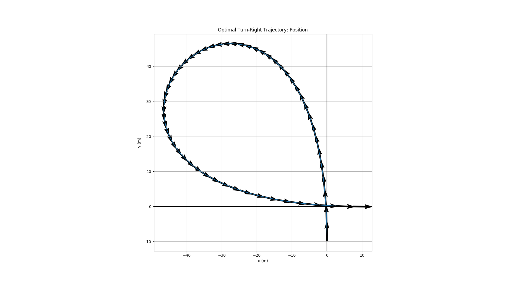
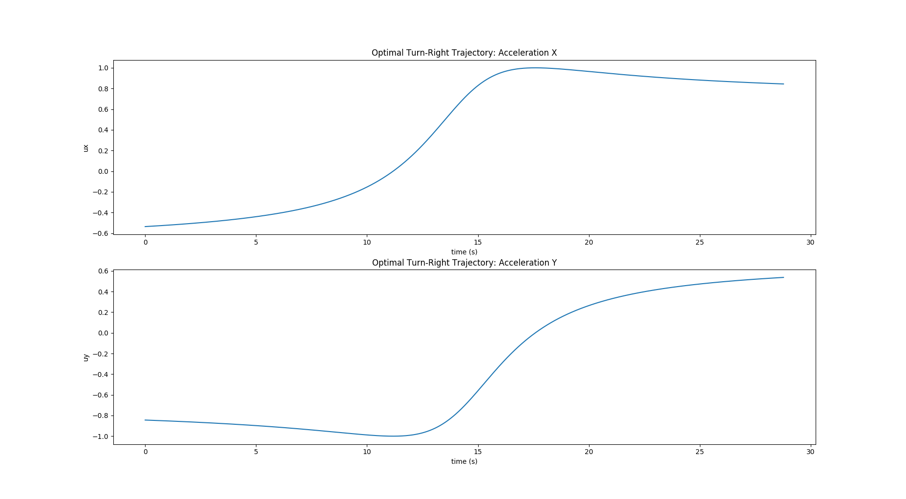
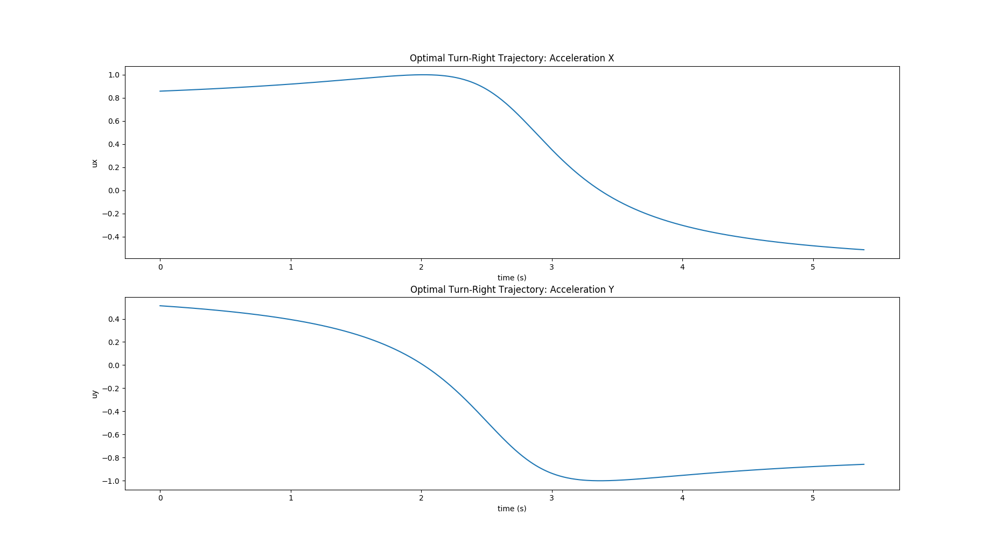

# Optimal Turn-Right Trajectory using Pontryagin's Maximum Principle

Optimal control solution to complete a 90 degrees turn right in the minimum amount of time, for a 2D particle controlled in acceleration.
The solution to this control problem is derived using **Pontryagin’s Maximum Principle**.

Write-up about the solution can be found here: [Time Optimal Turn-Right Trajectory using Pontryagin’s Maximum principle](Optimal_Trajectory_Pontryagin.pdf)

**Initial Velocity: 10 m/s**

 

**Initial Velocity: 2 m/s**

 

## Run the code:

```
python main.py --help

Optimal Turn-Right Trajectory using Pontryagin's Maximum Principle

optional arguments:
  -h, --help            show this help message and exit
  -max_accel MAX_ACCEL  Maximum Acceleration
  -init_pos INIT_POS    Initial position along Y axis
  -init_vel [INIT_VEL [INIT_VEL ...]]
                        Initial velocities
  -show_figures         Plot results on figures
  -no_save_csv          Do not save results
  -output_dir OUTPUT_DIR
                        Path of the output
```