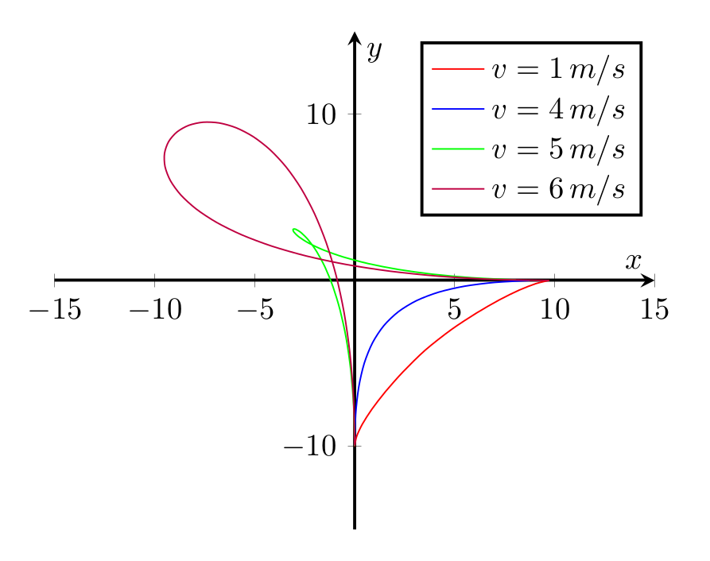

# Optimal Turn-Right Trajectory using Pontryagin's Maximum Principle

## Description

Small python script that solve the optimization problem to generate the time optimal trajectory given a maximum allowed acceleration, initial and final conditions. It is based on the application of Pontryagin's Maximum Principle.

#### Trajectories for different initial/final velocities:

## Run the code

	$ python main.py

Some results can be found in the `/result_examples` folder.

